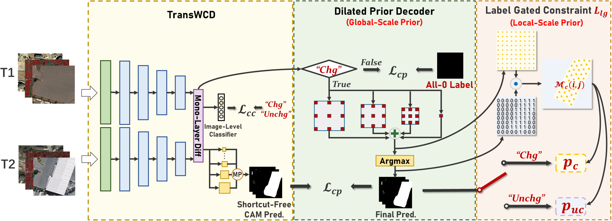

# TransWCD: Transformer-based Weakly-Supervised Change Detection Baselines
## :notebook_with_decorative_cover: Paper: Exploring Effective Priors and Efficient Models for Weakly-Supervised Change Detection [[arXiv]](https://arxiv.org/abs/2307.10853)

## Update
| :zap:        | Higher-performing TransWCD baselines with data augmentations have been released, with +2.47 F1 score on LEVIR-CD and +5.72 F1 score on DSIFN-CD compared to those mentioned in our paper. |
|--------------|:------------------------------------------------------------------------------------------------------------------------------------------------------------------------------------------|
##

## Abastract <p align="justify">
<blockquote align="justify">Weakly-supervised change detection (WSCD) aims to detect pixel-level changes with only image-level annotations. Owing to its label efficiency, WSCD is drawing increasing attention recently. However, current WSCD methods often encounter the challenge of change missing and fabricating, i.e., the inconsistency between image-level annotations and pixel-level predictions. Specifically, change missing refers to the situation that the WSCD model fails to predict any changed pixels, even though the image-level label indicates change, and vice versa for change fabricating. To address this challenge, in this work, we leverage global-scale and local-scale priors in WSCD and propose two components: a Dilated Prior (DP) decoder and a Label Gated (LG) constraint. The DP decoder decodes samples with the changed image-level label, skips samples with the unchanged label, and replaces them with an all-unchanged pixel-level label. The LG constraint is derived from the correspondence between changed representations and image-level labels, penalizing the model when it mispredicts the change status. Additionally, we develop TransWCD, a simple yet powerful transformer-based model, showcasing the potential of weakly-supervised learning in change detection. By integrating the DP decoder and LG constraint into TransWCD, we form TransWCD-DL. Our proposed TransWCD and TransWCD-DL achieve significant +6.33% and +9.55% F1 score improvements over the state-of-the-art methods on the WHU-CD dataset, respectively. Some performance metrics even exceed several fully-supervised change detection (FSCD) competitors.</blockquote>
</p>


## :speech_balloon: TransWCD Architectures (Encoder-Only):
<p align="center">
    
</p>

## :speech_balloon: TransWCD-DL Architecture:



##
## A. Preparations
### 1. Download Dataset
You can download [WHU-CD](https://study.rsgis.whu.edu.cn/pages/download/building_dataset.html), [DSIFN-CD](https://github.com/GeoZcx/A-deeply-supervised-image-fusion-network-for-change-detection-in-remote-sensing-images/tree/master/dataset), [LEVIR-CD](http://chenhao.in/LEVIR/), and other CD datasets, then use our `data_and_label_processing` to convert these raw change detection datasets into cropped weakly-supervised change detection datasets.

Or use the processed weakly-supervised datasets from [`here`](https://drive.google.com/drive/folders/1Ee4T4-pOhZSe9NJ4av4cPBkXh6PX8w71?usp=sharing). Please cite their papers and ours.
``` bash
WSCD dataset with image-level labels:
├─A
├─B
├─label
├─imagelevel_labels.npy
└─list
```

### 2. Download Pre-trained Weights

Download the pre-trained weights from [SegFormer](https://github.com/NVlabs/SegFormer) and move them to `pretrained/`.

### 3.Create and activate conda environment

```bash
conda create --name transwcd python=3.6
conda activate transwcd
pip install -r requirments.txt
```

##
## B. Train and Test
```bash
# train 
python train_transwcd.py

```
You can modify the corresponding implementation settings `WHU.yaml`, `LEVIR.yaml`, and `DSIFN.yaml` in `train_transwcd.py` for different datasets.

###
```bash
# test
python test.py
```
Please remember to modify the corresponding configurations in `test.py`, and the visual results can be found at `results/`

##
## C. Performance and Best Models
| TransWCD      |    WHU-CD |             LEVIR-CD |             DSIFN-CD |
|:--------------:|:----------:|:---------------------:|:---------------------:|  
| Single-Stream | 67.81/[best model](https://drive.google.com/file/d/1ZK9aNG-RG26ybLGAu9NqaG3-yPChL4Kx/view?usp=drive_link) | 51.06/[best model](https://drive.google.com/file/d/1z_7e057spJPP4BW_6Ujz8ws-PZ-GWufA/view?usp=drive_link) | 57.28/[best model](https://drive.google.com/file/d/1i9farsfLxDQBUxxfhjjOJz1zNgjavjoI/view?usp=drive_link) | 
| Dual-Stream   | 68.73/[best model](https://drive.google.com/file/d/1us1TCqkSfjNjuubasXmRN0vBJ2OAI2vl/view?usp=drive_link) | 62.55/[best model](https://drive.google.com/file/d/1cpr3ICsR4Ro5XtWA3I8RzDNzxkp1A_Fz/view?usp=drive_link) | 59.13/[best model](https://drive.google.com/file/d/1oGSlT64WRuzyY1vqmXb1Y55T0VrBJnhn/view?usp=drive_link) | 

*Average F1 Score / best model

##
## D. Visual Results
<p align="center">
    
</p>

## Citation
if it's helpful to your research, please kindly cite. Here is an example BibTeX entry:

``` bibtex
@article{zhao2023exploring,
  title={Exploring Effective Priors and Efficient Models for Weakly-Supervised Change Detection},
  author={Zhao, Zhenghui and Ru, Lixiang and Wu, Chen},
  journal={arXiv preprint arXiv:2307.10853},
  year={2023}
}
```

## Acknowledgement
We use the cropped dataset of [BGMix](https://github.com/tsingqguo/bgmix) and [ChangeFormer](https://github.com/wgcban/ChangeFormer).
and the [pre-trained weights](https://drive.google.com/drive/folders/1b7bwrInTW4VLEm27YawHOAMSMikga2Ia?usp=sharing) from [SegFormer](https://github.com/NVlabs/SegFormer). 

Thanks to their brilliant works!

